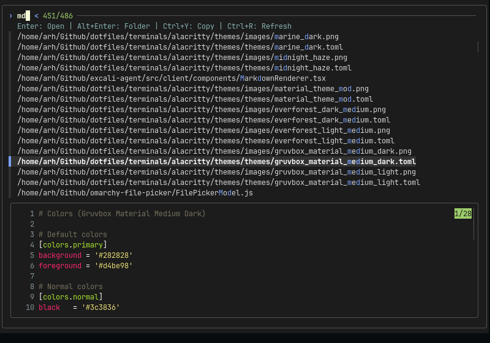
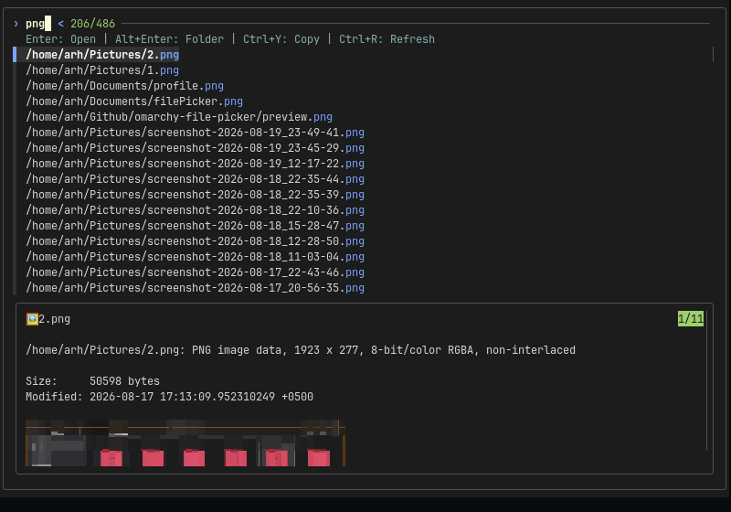

# 🔍 Omarchy File Picker (`arh.file-picker`)

A high-performance fuzzy file search and launcher plugin for **[Omarchy](https://omarchy.org/)** and **Hyprland**.

Quickly find and open documents, notes, videos, audio, images, and code files from your configured directories using an **interactive terminal TUI** powered by `fzf`.

---

<p align="center">
  
</p>

<p align="center">
  
</p>

---

## ✨ Features

- ⚡ **Lightning Fast Scanning**: Uses `fd` (with fallback to `find`) for sub-50ms directory indexing with background caching.
- 🗂️ **Configurable Directories & File Types**: Simple JSON configuration (`~/.config/omarchy/file-picker.json`) to add/remove search folders, categories, and exclusions.
- 🖼️ **Image & Video Thumbnails**: Live terminal image previews via `chafa`, video frame thumbnails via `ffmpegthumbnailer`.
- 📄 **Rich File Previews**: PDF text extraction (`pdftotext`), syntax-highlighted code/markdown (`bat`), audio/video metadata (`ffprobe`).
- 🏷️ **Category Filtering**: Instant category pills for **All**, **Docs**, **Notes**, **Videos**, **Audio**, **Images**, and **Code**.
- 🔗 **Action Shortcuts**: Open file (`Enter`), open folder in file manager (`Alt+Enter`), or copy file path (`Ctrl+Y`).

---

## 📦 Installation

Install and enable the plugin directly with the Omarchy CLI:

```bash
omarchy plugin add https://github.com/iamArham10/omarchy-file-picker.git --enable
```

### Optional Dependencies

For the best preview experience, install these packages:

```bash
sudo pacman -S chafa ffmpegthumbnailer
```

| Package | Purpose |
|---|---|
| `chafa` | Renders image and video thumbnails in the terminal preview |
| `ffmpegthumbnailer` | Extracts video frame thumbnails for preview |
| `bat` | Syntax-highlighted code and markdown previews (usually pre-installed) |
| `pdftotext` (`poppler`) | PDF text extraction for preview |

---

## ⌨️ Hyprland Keybinding Configuration

Add the keybinding to your `~/.config/hypr/bindings.lua`:

```lua
-- Fuzzy file picker (floating fzf window with live previews; rule in hyprland.lua)
o.bind("SUPER + I", "Fuzzy file picker", "alacritty --title fzf-picker -e omarchy-file-picker")
```

---

## ⚙️ Configuration

The configuration file is automatically created at:
```
~/.config/omarchy/file-picker.json
```

You can open and edit it anytime by running:
```bash
omarchy-file-picker --config
```

### Example `~/.config/omarchy/file-picker.json`

```json
{
  "directories": [
    "~/Documents",
    "~/Downloads",
    "~/Desktop",
    "~/Github",
    "~/Videos",
    "~/Music",
    "~/Pictures",
    "~/Obsidian"
  ],
  "categories": {
    "all": [],
    "documents": ["pdf", "epub", "djvu", "docx", "pptx", "xlsx", "txt", "csv", "odt", "ods", "odp", "rtf"],
    "notes": ["md", "markdown", "org", "rst", "adoc"],
    "videos": ["mp4", "mkv", "avi", "mov", "webm", "flv", "wmv", "m4v"],
    "audio": ["mp3", "flac", "ogg", "wav", "m4a", "aac", "opus"],
    "images": ["png", "jpg", "jpeg", "webp", "gif", "svg", "bmp", "avif"],
    "code": ["py", "rs", "go", "js", "ts", "jsx", "tsx", "c", "cpp", "h", "hpp", "sh", "bash", "zsh", "lua", "json", "toml", "yaml", "yml"]
  },
  "excludeDirectories": [
    "node_modules", ".git", "__pycache__", ".cache", "dist", "build",
    "out", ".next", "vendor", "venv", ".venv", "target", ".cargo",
    ".idea", ".vscode", "coverage"
  ],
  "cacheTtlSeconds": 300,
  "maxResults": 2000
}
```

---

## 🚀 CLI Commands

```bash
# Open the interactive terminal TUI (default)
omarchy-file-picker

# Pre-filter by category
omarchy-file-picker --category images
omarchy-file-picker --category videos

# Re-index all directories and force refresh the cache
omarchy-file-picker --refresh

# Open the JSON configuration file in your editor
omarchy-file-picker --config
```

---

## ⌨️ Shortcuts

| Key | Action |
|---|---|
| `↑` / `↓` | Navigate file list |
| `Enter` | Open selected file in default app (`xdg-open`) |
| `Alt + Enter` | Open containing directory |
| `Ctrl + Y` | Copy file path to clipboard (`wl-copy`) |
| `Ctrl + R` | Force refresh cache |
| `Esc` | Close picker |

---

## 🔒 Security & Scope

- **Local Execution Only**: No network requests, telemetry, or external API calls.
- **Sandboxed Caching**: File metadata cache is stored strictly in user space (`~/.cache/omarchy/file-picker/`).
- **Standard Desktop Integration**: Uses standard `xdg-open` to launch user-selected files in their chosen system apps.

---

## 🛠️ Verification & Development

To validate the plugin against the Omarchy shell manifest schema:

```bash
omarchy plugin validate ~/.config/omarchy/plugins/arh.file-picker
```

To reload plugins after modifying QML files:

```bash
omarchy-shell shell rescanPlugins
```

---

## 📜 License

[MIT License](LICENSE) © 2026 Arham Imran
